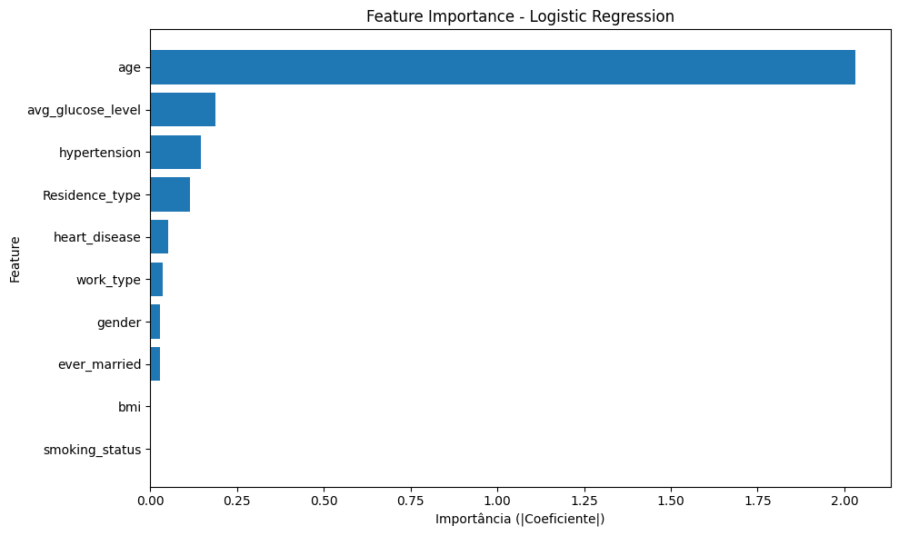
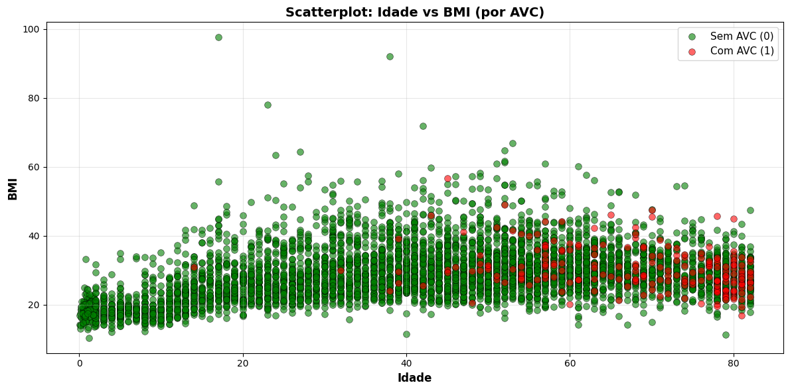

# Stroke App

Este repositório contém código e notebooks usados no projeto de previsão de risco de AVC (stroke). Este arquivo explica como instalar e executar o projeto localmente e descreve a hierarquia de pastas.

---

## Requisitos

- macOS / Linux / Windows
- Python 3.9+ (recomendado 3.10+)
- `make` (opcional, usado no Makefile)
- Git


## Instalação (passos rápidos)

1. Clone o repositório (se ainda não tiver):

```bash
git clone <repo-url>
cd stroke-app
```

2. Criar e ativar um ambiente virtual:

```bash
python -m venv .venv
source .venv/bin/activate    # macOS / Linux
.\\.venv\\Scripts\\activate   # Windows (PowerShell/CMD)
```

3. Atualizar `pip` e instalar dependências:

- Este repositório inclui um arquivo `requirements.txt`. Para instalar as dependências listadas, rode:

```bash
pip install -U pip
pip install -r requirements.txt
```

---

## Como rodar

- Antes de abrir o app, é necessário treinar o modelo:

```bash
python main.py
```

- Abrir um terminal na pasta do projeto (stroke-app) e executar o comando:

```bash
python src/api/app.py
```

- Abrir outra aba do terminal na mesma pasta e executar o comando:

```bash
streamlit run streamlit_app.py
```

- A aplicação irá abrir num browser.

---

## Feature Importance

São as features mais importantes, as que mais influenciam nos resultados. A figura abaixo mostra as 10 features que mais impactam no resultado, em ordem de importância.



Uma figura que pode explanar isso é o Scatterplot que confronta Idade e BMI, e a cor indica se a pessoa teve ou não AVC. Ao analisá-la, percebe-se que o avançar da idade vai colorindo o gráfico de vermelho, enquanto que a variação no eixo do BMI não há um padrão (a feature não tem um nível alto no Feature Importance).




---

## Hierarquia do projeto

A seguir está a estrutura de pastas principal do repositório (visão geral):

```
main.py
Makefile
catboost_info/
    catboost_training.json
    learn_error.tsv
    time_left.tsv
    learn/
        events.out.tfevents
    tmp/
config/
    __init__.py
    settings.py
data/
    processed/
    raw/
        healthcare-dataset-stroke-data.csv
notebooks/
    01_exploratory_analysis.ipynb
    02_data_preprocessing.ipynb
    03_model_training.ipynb
src/
    api/
        app.py
    etl/
        __init__.py
        etl.py
        extract.py
        transform.py
    models/
        model_training.py
    preprocessing/
streamlit/
    streamlit_app.py
```

Breve descrição das pastas principais:

- `config`: arquivos de configuração e settings do projeto.
- `data`: dados brutos e processados (não versionar dados sensíveis/public).
- `notebooks`: análises exploratórias e notebooks de treinamento.
- `src`: código-fonte (ETL, API, modelos, pré-processamento).
- `streamlit`: aplicação front-end em Streamlit.
- `catboost_info`: artefatos relacionados ao treinamento com CatBoost.


## Observações

- Ajuste versões de dependências conforme indicado nos notebooks ou arquivos de configuração.

---
